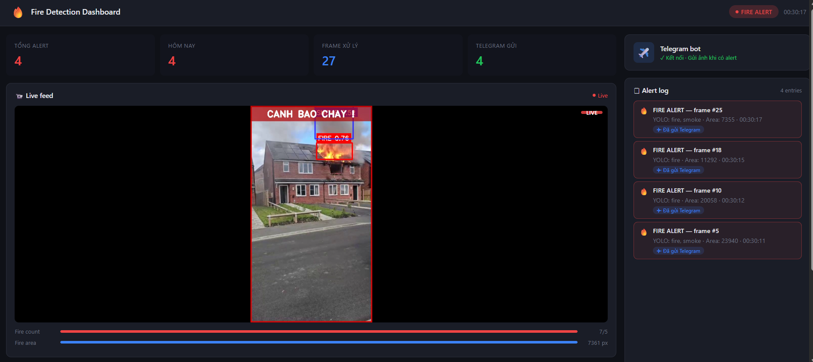
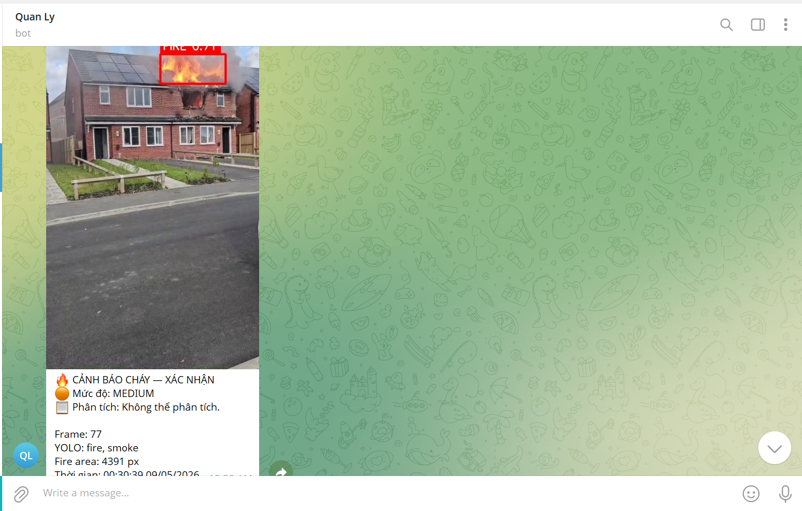

# 🔥 Fire Detection System — Hệ thống Phát hiện & Cảnh báo Cháy

> Hệ thống phát hiện và cảnh báo cháy trong video giám sát theo thời gian thực, kết hợp **YOLOv8**, **xử lý màu sắc HSV**, **Gemini VLM** (phân tích hình ảnh bằng AI), và **Telegram Bot** gửi cảnh báo tức thì.

---

## 📸 Demo

| Dashboard | Cảnh báo Telegram |
|:---------:|:-----------------:|
|  |  |

> 💡 Đặt ảnh chụp màn hình vào thư mục `assets/` trong project để hiển thị đúng.

---

## 📥 Tải xuống Model & Video

> Các file nặng không được lưu trên GitHub. Tải về và đặt đúng thư mục theo hướng dẫn bên dưới.

| File | Mô tả | Thư mục đặt vào |
|------|-------|----------------|
| 🤖 `fire_yolo.pt` | Model YOLOv8 đã train | `models/` |
| 🎬 `fire.mp4` | Video demo chính | `video/` |
| 🎬 `fire_detec.mp4` | Video test thêm | `video/` |

**[⬇️ Tải tất cả tại đây (Google Drive)](https://drive.google.com/drive/folders/13cvVYkYfe0eZWnbjgmIkMlVE5q21X7zN?usp=sharing)**

Sau khi tải về, đặt file vào đúng vị trí:
```
FIRE_DETECTION/
├── models/
│   └── fire_yolo.pt      ← đặt vào đây
└── video/
    ├── fire.mp4          ← đặt vào đây
    └── fire_detec.mp4    ← đặt vào đây
```

---

## 🧠 Kiến trúc hệ thống

```
Video Input (MP4 / Camera)
        │
        ▼
┌───────────────────────┐
│  FireImageProcessor   │  ← Phát hiện màu lửa (HSV)
└───────────┬───────────┘
            │
┌───────────▼───────────┐
│   YOLOFireDetector    │  ← Phát hiện lửa/khói bằng YOLOv8
└───────────┬───────────┘
            │
┌───────────▼───────────┐
│   GeminiFireAnalyzer  │  ← Xác nhận & đánh giá mức độ (Gemini 2.0 Flash)
└───────────┬───────────┘
            │
┌───────────▼───────────┐
│   TelegramNotifier    │  ← Gửi ảnh + báo cáo qua Telegram Bot
└───────────────────────┘
            │
┌───────────▼───────────┐
│   Flask Dashboard     │  ← Xem live feed + log + biểu đồ tại localhost:5000
└───────────────────────┘
```

---

## 📁 Cấu trúc thư mục

```
FIRE_DETECTION/
├── models/
│   └── fire_yolo.pt          # Model YOLOv8 đã train để phát hiện lửa/khói
├── output/
│   ├── frames/               # Ảnh alert được lưu tự động
│   ├── logs/                 # Log file fire_log.txt
│   └── result_video/         # (tuỳ chọn) Video kết quả
├── src/
│   ├── image_processing.py   # Phát hiện lửa bằng màu HSV
│   ├── telegram_notifier.py  # Gửi cảnh báo Telegram (async)
│   ├── vlm_analyzer.py       # Phân tích ảnh bằng Gemini AI
│   └── yolo_detector.py      # Wrapper cho YOLOv8
├── templates/
│   └── index.html            # Giao diện web dashboard
├── video/
│   ├── fire.mp4              # Video demo chính
│   └── fire_detec.mp4        # Video test thêm
├── app.py                    # Flask web app (dashboard)
├── config.py                 # Cấu hình toàn bộ hệ thống
├── main.py                   # Chạy trực tiếp (không cần web)
├── test_yolo.py              # Script test model YOLO
├── requirements.txt          # Danh sách thư viện
└── README.md
```

---

## ⚙️ Yêu cầu hệ thống

- Python **3.10+**
- pip
- (Tuỳ chọn) GPU với CUDA để tăng tốc YOLO

---

## 🚀 Hướng dẫn cài đặt & chạy

### 1. Clone repository

```bash
git clone https://github.com/<your-username>/fire-detection.git
cd fire-detection
```

### 2. Tạo môi trường ảo (khuyến nghị)

```bash
python -m venv venv

# Windows
venv\Scripts\activate

# macOS / Linux
source venv/bin/activate
```

### 3. Cài đặt thư viện

```bash
pip install -r requirements.txt
```

Hoặc cài thủ công từng thư viện:

```bash
pip install opencv-python
pip install numpy
pip install flask
pip install ultralytics          # YOLOv8
pip install requests
pip install google-genai         # Gemini API
```

### 4. Cấu hình `config.py`

Mở file `config.py` và điền thông tin của bạn:

```python
TELEGRAM_BOT_TOKEN = "YOUR_TELEGRAM_BOT_TOKEN"
TELEGRAM_CHAT_ID   = "YOUR_TELEGRAM_CHAT_ID"
GEMINI_API_KEY     = "YOUR_GEMINI_API_KEY"

VIDEO_PATH        = "video/fire.mp4"      # Đường dẫn video đầu vào
MODEL_PATH        = "models/fire_yolo.pt" # Đường dẫn model YOLO

MIN_FIRE_AREA     = 1200   # Diện tích pixel tối thiểu để coi là lửa
ALERT_FRAME_COUNT = 5      # Số frame liên tiếp để kích hoạt alert
YOLO_CONF         = 0.20   # Ngưỡng confidence của YOLO
ALERT_COOLDOWN    = 2      # Giây chờ giữa 2 lần gửi cảnh báo
```

> **Cách lấy Telegram Bot Token & Chat ID:**
> 1. Nhắn tin cho [@BotFather](https://t.me/BotFather) → `/newbot` → lấy token
> 2. Nhắn bất kỳ tin nhắn cho bot của bạn, sau đó truy cập:
>    `https://api.telegram.org/bot<TOKEN>/getUpdates` → lấy `chat.id`

> **Cách lấy Gemini API Key:**
> Truy cập [Google AI Studio](https://aistudio.google.com/app/apikey) → tạo API key miễn phí

### 5. Thêm video và model

- Đặt file video vào thư mục `video/` (mặc định: `fire.mp4`)
- Đặt file model YOLOv8 vào thư mục `models/` (mặc định: `fire_yolo.pt`)

> Nếu chưa có model, bạn có thể train bằng [Ultralytics YOLOv8](https://docs.ultralytics.com) với dataset lửa/khói, hoặc tải model pretrain từ cộng đồng.

---

## ▶️ Chạy chương trình

### Chạy Web Dashboard (Flask)

```bash
python app.py
```

Sau đó mở trình duyệt tại: **http://localhost:5000**

Dashboard hiển thị:
- 📹 Live feed video với overlay nhận diện
- 📊 Biểu đồ số alert theo giờ
- 🗒 Alert log chi tiết
- 📈 Các metrics: tổng alert, frame xử lý, số lần gửi Telegram

### Chạy trực tiếp (không cần web)

```bash
python main.py
```

Cửa sổ OpenCV sẽ hiển thị video với overlay nhận diện. Nhấn `Q` để thoát.

### Test model YOLO

```bash
python test_yolo.py
```

---

## 🔍 Cách hoạt động

### 1. Phát hiện màu lửa (HSV)
`image_processing.py` chuyển frame sang không gian màu HSV và dùng hai dải màu để phát hiện lửa:
- Đỏ cam: `H[0–15]`, `S[120–255]`, `V[150–255]`
- Cam vàng: `H[15–35]`, `S[100–255]`, `V[150–255]`

Kết quả là một mask nhị phân và diện tích pixel lửa.

### 2. Phát hiện bằng YOLOv8
`yolo_detector.py` chạy model YOLOv8 tùy chỉnh (`fire_yolo.pt`) để phát hiện các nhãn `fire` và `smoke`, trả về bounding box và confidence.

### 3. Cơ chế đếm frame (fire_count)
- Mỗi frame phát hiện lửa (YOLO hoặc màu sắc): `fire_count += 1`
- Mỗi frame không phát hiện: `fire_count -= 1`
- Khi `fire_count >= ALERT_FRAME_COUNT` (mặc định 5): kích hoạt **FIRE ALERT**

Cơ chế này giúp tránh cảnh báo giả do nhiễu trong một vài frame đơn lẻ.

### 4. Xác nhận bằng Gemini AI
Khi có FIRE ALERT, `vlm_analyzer.py` gửi frame đến **Gemini 2.0 Flash** để:
- Xác nhận có cháy thật không (`confirmed: true/false`)
- Mô tả tình huống bằng tiếng Việt
- Đánh giá mức độ: `low` / `medium` / `high`

### 5. Gửi cảnh báo Telegram
`telegram_notifier.py` gửi ảnh + báo cáo đến Telegram Bot theo dạng:

```
🔥 CẢNH BÁO CHÁY — XÁC NHẬN
🔴 Mức độ: HIGH
📋 Phân tích: Phát hiện ngọn lửa lớn lan rộng trong khu vực kho hàng.

Frame: 342
YOLO: fire, smoke
Fire area: 2840 px
Thời gian: 14:23:05 09/05/2026
```

---

## 📦 requirements.txt (tham khảo)

```
opencv-python>=4.8.0
numpy>=1.24.0
flask>=3.0.0
ultralytics>=8.0.0
requests>=2.31.0
google-genai>=0.8.0
```

---

## 🛠️ Tuỳ chỉnh nâng cao

| Tham số | File | Mô tả |
|---------|------|-------|
| `MIN_FIRE_AREA` | `config.py` | Tăng để giảm false positive từ màu sắc |
| `ALERT_FRAME_COUNT` | `config.py` | Tăng để cần nhiều frame hơn trước khi alert |
| `YOLO_CONF` | `config.py` | Tăng để YOLO nghiêm ngặt hơn (ít false positive) |
| `ALERT_COOLDOWN` | `config.py` | Tăng để giảm số lần gửi Telegram |
| HSV ranges | `image_processing.py` | Tinh chỉnh để phù hợp với điều kiện ánh sáng |

---

## ⚠️ Lưu ý bảo mật

- **Không commit `config.py`** chứa API key và token lên Git. Thêm vào `.gitignore`:
  ```
  config.py
  venv/
  output/
  ```
- Sử dụng biến môi trường hoặc file `.env` cho production.

---

## 📄 Giấy phép

MIT License — Tự do sử dụng, chỉnh sửa và phân phối.

---

## 👤 Tác giả

Dự án được xây dựng với mục đích học tập và nghiên cứu về Computer Vision, AI và hệ thống cảnh báo thời gian thực.

---

*Made with ❤️ using YOLOv8 · OpenCV · Flask · Gemini AI · Telegram Bot*
